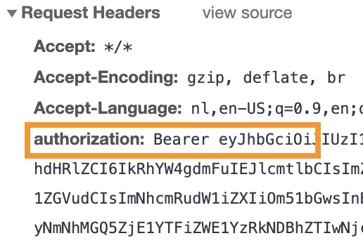

# POC REST api met Avans login

Deze applicatie is geen product van, voor of door Avans Hogeschool.

Met dit proof of concept wil ik aantonen dat het mogelijk is om een REST api te beveilingen met passport, passport-avans en passport-jwt.

## Endpoints

- `/` --> Laat een html pagina zien met een login knop, of met de gebruikersgegevens.
- `/auth/avans` --> Redirect de user naar de avans login pagina
- `/auth/avans/callback` --> Zet de token & token_secret van avans om naar een JWT om te gebruiken met de REST api
- `/me` --> Geeft de user details uit de JWT terug (verwacht een `Authorization` header met `Bearer {JWT}`)

### Authorization header voorbeeld

